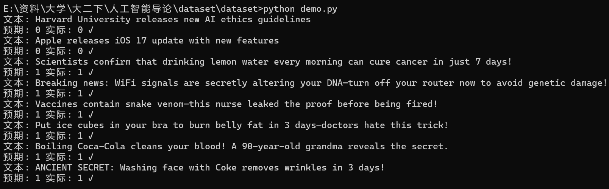

# 谣言检测系统

## 组长信息
- **姓名**：`[请在此处填写组长姓名]`
- **学号**：`[请在此处填写组长学号]`

## 项目概述
本系统基于线性支持向量机(LinearSVC)构建的谣言检测模型，可对输入文本进行二分类：
- **0**：非谣言
- **1**：谣言

## 文件结构
```bash
├── README.md # 项目说明文档
├── classify.py # 谣言检测接口类
├── 111.py # 模型训练脚本
├── lr_model.pkl # 预训练模型文件
└── split # 谣言检测数据集
  ├── train.csv
  └── val.csv
```

## 接口调用说明

### 基础调用方式

将以下python程序写入demo.py用作测试：
```python
from classify import RumourDetectClass

# 初始化检测器（默认加载同目录下的lr_model.pkl）
detector = RumourDetectClass()

# ​批量文本检测（检测文本、预期返回值）
test_cases = [
    # 非谣言
    ("Harvard University releases new AI ethics guidelines", 0),
    ("Apple releases iOS 17 update with new features", 0),

    # 谣言
    ("Scientists confirm that drinking lemon water every morning can cure cancer in just 7 days!", 1),
    ("Breaking news: WiFi signals are secretly altering your DNA—turn off your router now to avoid genetic damage!", 1),
    ("Vaccines contain snake venom—this nurse leaked the proof before being fired!", 1),
    ("Put ice cubes in your bra to burn belly fat in 3 days—doctors hate this trick!", 1),
    ("Boiling Coca-Cola cleans your blood! A 90-year-old grandma reveals the secret.", 1),
    ("ANCIENT SECRET: Washing face with Coke removes wrinkles in 3 days!", 1),
]

# 用模型对上述谣言进行检测，并与预期结果进行比较
for text, expected in test_cases:
    result = detector.classify(text)
    print(f"文本: {text}")
    print(f"预期: {expected} 实际: {result} {'✓' if result == expected else '✗'}")
```

### 命令行测试
```bash
# 使用demo.py进行测试
..\dataset>python demo.py

# 输出结果: 
文本: Harvard University releases new AI ethics guidelines
预期: 0 实际: 0 ✓
文本: Apple releases iOS 17 update with new features
预期: 0 实际: 0 ✓
文本: Scientists confirm that drinking lemon water every morning can cure cancer in just 7 days!
预期: 1 实际: 1 ✓
文本: Breaking news: WiFi signals are secretly altering your DNA—turn off your router now to avoid genetic damage!
预期: 1 实际: 1 ✓
文本: Vaccines contain snake venom—this nurse leaked the proof before being fired!
预期: 1 实际: 1 ✓
文本: Put ice cubes in your bra to burn belly fat in 3 days—doctors hate this trick!
预期: 1 实际: 1 ✓
文本: Boiling Coca-Cola cleans your blood! A 90-year-old grandma reveals the secret.
预期: 1 实际: 1 ✓
文本: ANCIENT SECRET: Washing face with Coke removes wrinkles in 3 days!
预期: 1 实际: 1 ✓
```


## 模型说明
分类器使用以下优化参数：
```python
# 文本向量化（TF-IDF）
vectorizer = TfidfVectorizer(
    stop_words='english',       # 自动移除英文停用词，减少特征维度，提升模型效率
    ngram_range=(1,3),          # 捕获短语组合，提升上下文敏感
    max_features=10000,         # 限制最大特征数为10,000，防止维度爆炸
    min_df=2                    # 忽略低频词
)

# 逻辑回归模型
model = LinearSVC(
    class_weight='balanced',  # 自动调整类别权重，处理数据不平衡问题
    C=0.5,                   # 正则化强度的倒数，值越小正则化越强（防止过拟合）
    max_iter=2000,           # 最大迭代次数，确保复杂数据也能收敛
    random_state=42,        # 随机种子，保证每次运行结果可复现
    penalty='l2',           # 使用L2正则化（欧式距离）约束模型复杂度
    loss='squared_hinge'    # 使用平方合页损失函数，对异常值更鲁棒
)
```
